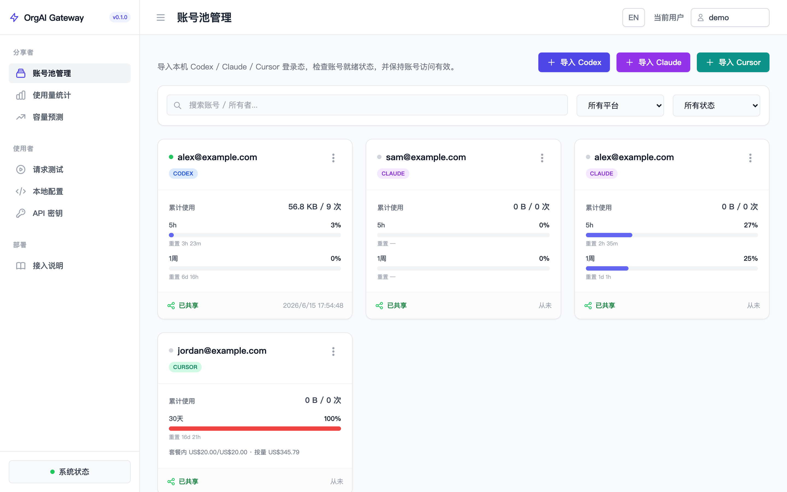
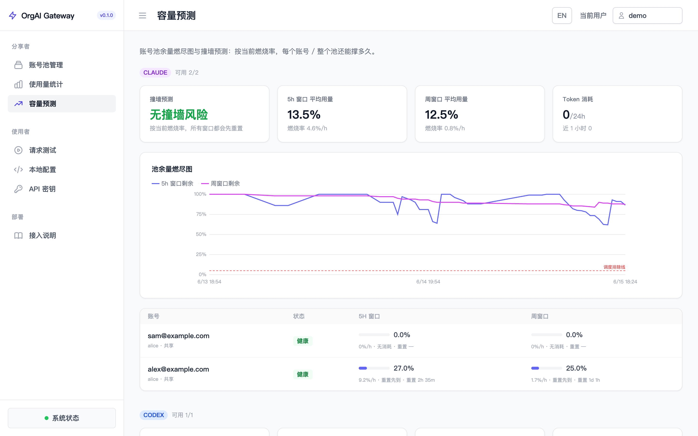
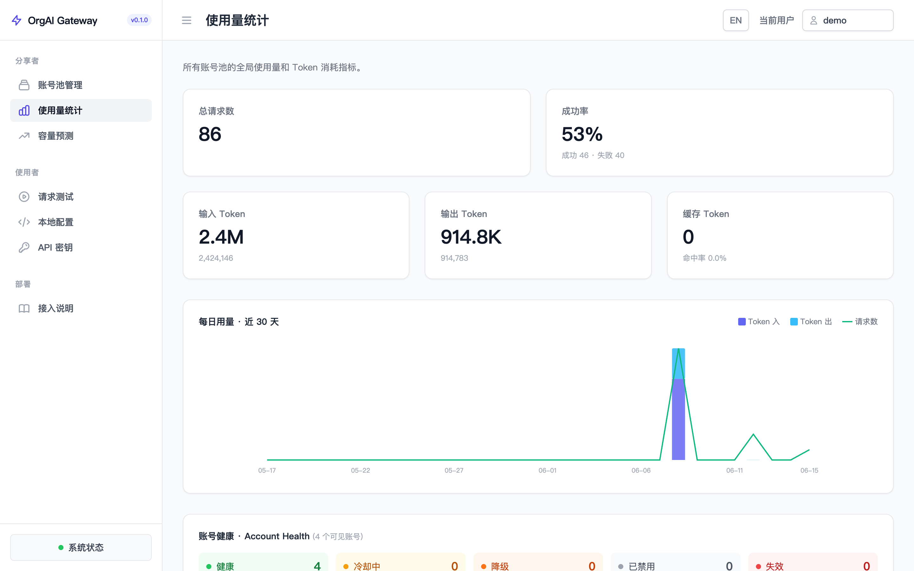
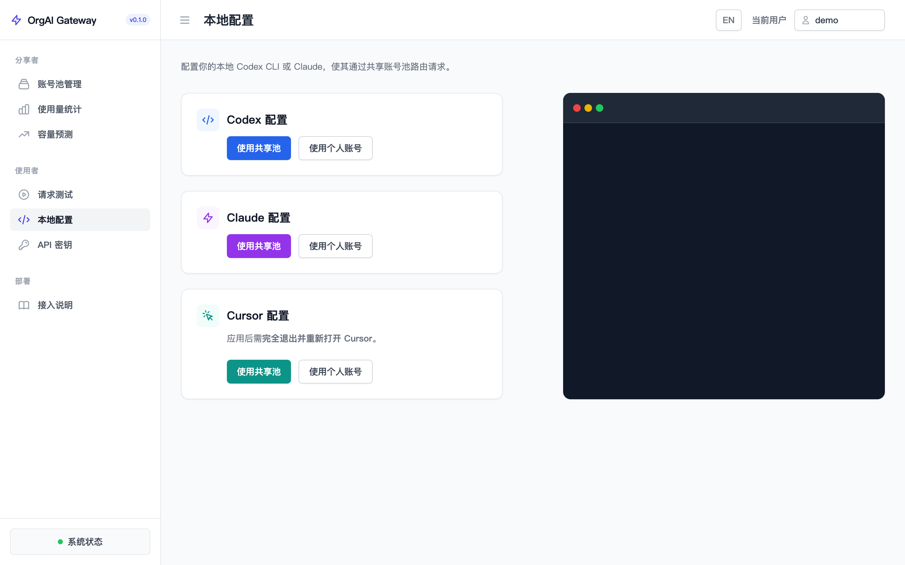
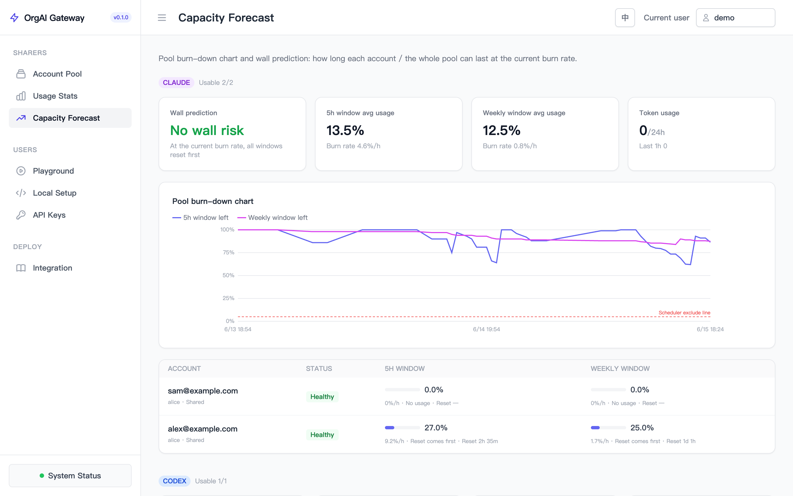
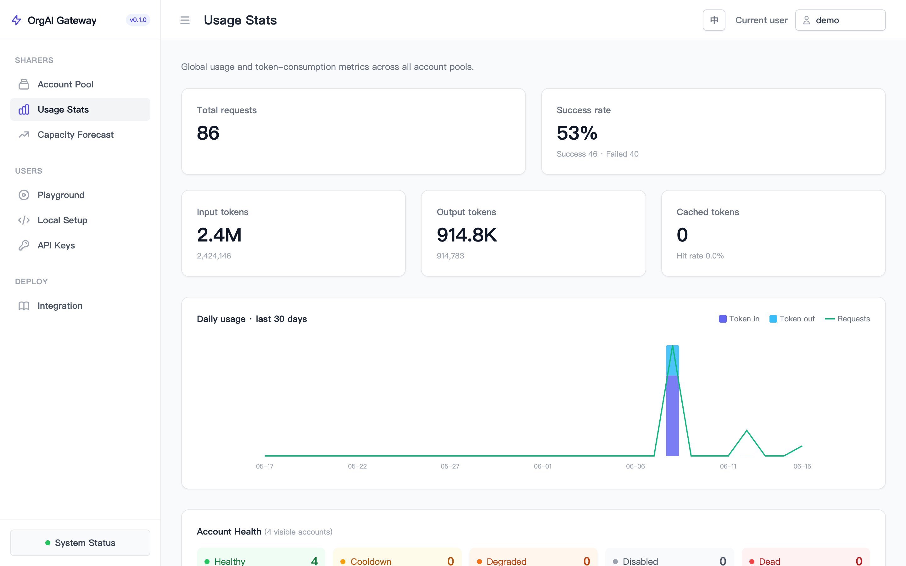
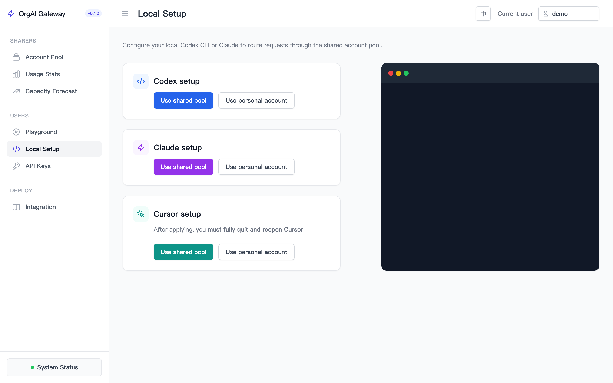
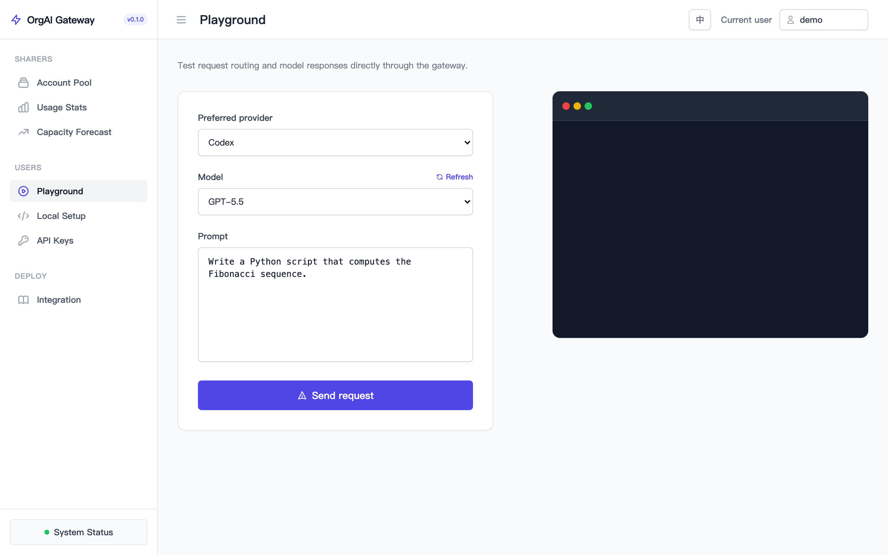

<div align="center">

# ⚡ OrgAI Gateway

**一套组织内共享的 AI 账号池网关 — 把团队捐出的 Codex / Claude / Cursor 订阅，安全、智能地分发给每个人。**

*A self-hosted gateway that pools your team's Codex / Claude / Cursor subscriptions and routes everyone's traffic across them — safely and intelligently.*

[](https://www.rust-lang.org/)
[](https://github.com/tokio-rs/axum)
[](#license)

[中文](#中文) · [English](#english)



</div>

---

<a name="中文"></a>

## 中文

### 这是什么

团队里总有人有 Codex、Claude、Cursor 的订阅，也总有人临时需要却没有。OrgAI Gateway 让有订阅的人**一行命令捐出账号**，其余人无需自己付费，直接通过网关使用 —— 网关在多个账号间智能调度、预测容量、统计用量，并把每个人的身份和配额管得清清楚楚。

它是一个用 **Rust** 写的单二进制服务，原生转发 Codex (`/v1/responses`)、Claude (`/v1/messages`) 与 Cursor 的真实上游协议，对客户端完全透明。

### 核心特性

- **🪪 一行命令捐号** — 捐号人在自己机器上 `curl …/donate.sh | sh`，本地读取登录态、经 HTTPS 提交一次即进入共享池，浏览器读不到的凭据（Keychain、`state.vscdb`）也能捐。
- **🧭 智能调度** — 粘性会话保 prompt cache，但当绑定账号接近限流墙时主动迁移到余量更充足的同类账号，避免一路粘到硬排除线。
- **📈 容量预测** — 双窗口（5h + 周）用量时间序列、燃烧率、撞墙预测与全池耗尽时间，提前发现风险账号。
- **🔐 零 SDK 接入** — 把你现有的 SSO / OAuth 挂在网关前，用可信边缘头（`X-Gateway-Auth` + `X-User-Id`）传递身份；脚本与第三方程序则用 `oag_` API 密钥。
- **⚖️ 配额与预算** — 按账号设每日捐出上限，按用户设日/周 token 预算与 RPM 限流；超额者被限制只走自己的账号，而非一刀切断。
- **🛡️ 生产级运维** — OAuth Token 主动+被动刷新、账号健康探测与自动复活、优雅关闭排空在途请求、凭据存储崩溃安全（temp + fsync + rename）。

### 快速开始

```bash
cargo run            # 默认监听 0.0.0.0:8080
```

打开 `http://127.0.0.1:8080/` 即是管理面板。捐号人在**自己的机器**上执行：

```bash
# 自动探测并捐出本机已登录的 codex / claude / cursor 账号
curl -fsSL https://你的网关/donate.sh | sh
```

发一个请求试试：

```bash
curl -X POST http://127.0.0.1:8080/v1/messages \
  -H "Authorization: Bearer user:koltyu" \
  -H "Content-Type: application/json" \
  -d '{"model":"claude-sonnet-4","messages":[{"role":"user","content":"hi"}]}'
```

### 界面一览

| 容量预测 | 使用量统计 |
|:--:|:--:|
|  |  |
| **本地配置** | **请求测试** |
|  |  |

### 身份与安全

网关本身不做登录。身份解析按以下优先级：

1. **可信边缘头** — 边缘密钥匹配时，信任 `X-User-Id`（与 oauth2-proxy / Envoy ext_authz / nginx `auth_request` 的 trusted-header 模式一致）。
2. **API 密钥** — `Authorization: Bearer oag_…`，认作密钥归属人，供脚本绕过 SSO 边缘。
3. **自报身份** — `Authorization: Bearer user:<id>`，仅用于本地开发或受信网络。

> **安全前提**：终端用户绝不能直连网关，必须经过可信外层（网关只监听内网或仅放行外层 IP）。两道闸：边缘密钥（应用层）+ 网络隔离。

### 常用环境变量

| 变量 | 作用 |
| --- | --- |
| `GATEWAY_BIND_ADDR` | 监听地址（默认 `0.0.0.0:8080`） |
| `GATEWAY_EDGE_SECRET` | 可信边缘共享密钥，设置即启用身份头信任 |
| `GATEWAY_USER_DAILY_TOKEN_LIMIT` / `…_WEEKLY_…` / `…_RPM_LIMIT` | 按用户的借用预算与限流 |
| `GATEWAY_HEALTH_PROBE_SECS` | 账号健康探测周期（默认 120s，`0` 关闭） |
| `GATEWAY_HTTP_TIMEOUT_SECS` | 上游 HTTP 总超时（默认 600s） |

### 已知取舍

HTTP 代理路径（`/v1/messages` 等）会把上游响应**整体缓冲后回吐**，换取安全的换号重试与策略热切换，因此流式客户端的首字延迟约等于完整生成时长；Codex 走 WebSocket relay 有真流式。

### 路线图

1. 静态加密磁盘上的上游 Token（当前明文存于 `accounts.ndjson`）
2. 审计落库 PostgreSQL，加不可篡改链路
3. 暴露 Prometheus `/metrics`

---

<a name="english"></a>

## English

### What it is

Someone on your team always has a Codex, Claude, or Cursor subscription — and someone always needs one but doesn't. OrgAI Gateway lets subscribers **donate their account with one command**, so everyone else uses it through the gateway without paying. The gateway schedules across accounts intelligently, forecasts capacity, tracks usage, and keeps every user's identity and quota clearly accounted for.

It's a single **Rust** binary that natively forwards the real upstream protocols of Codex (`/v1/responses`), Claude (`/v1/messages`), and Cursor — fully transparent to clients.

### Highlights

- **🪪 One-command donation** — donors run `curl …/donate.sh | sh` on their own machine; credentials are read locally and submitted once over HTTPS. Even browser-inaccessible secrets (Keychain, `state.vscdb`) can be donated.
- **🧭 Smart scheduling** — sticky sessions preserve prompt cache, but migrate to a fresher same-kind account as the bound one nears its rate-limit wall — never stuck riding one account to the hard cutoff.
- **📈 Capacity forecast** — dual-window (5h + weekly) usage series, burn rate, wall prediction, and whole-pool exhaustion time surface at-risk accounts early.
- **🔐 Zero-SDK onboarding** — put your existing SSO / OAuth in front and pass identity via trusted-edge headers (`X-Gateway-Auth` + `X-User-Id`); scripts and third-party tools use `oag_` API keys.
- **⚖️ Quotas & budgets** — per-account daily donation caps, plus per-user daily/weekly token budgets and RPM limits. Over-budget users are restricted to their own account rather than cut off.
- **🛡️ Production-grade ops** — active + passive OAuth token refresh, account health probing with auto-revival, graceful shutdown that drains in-flight requests, crash-safe credential storage (temp + fsync + rename).

### Quick start

```bash
cargo run            # listens on 0.0.0.0:8080 by default
```

Open `http://127.0.0.1:8080/` for the admin console. Donors run, **on their own machine**:

```bash
# auto-detects and donates locally logged-in codex / claude / cursor accounts
curl -fsSL https://your-gateway/donate.sh | sh
```

Send a request:

```bash
curl -X POST http://127.0.0.1:8080/v1/messages \
  -H "Authorization: Bearer user:koltyu" \
  -H "Content-Type: application/json" \
  -d '{"model":"claude-sonnet-4","messages":[{"role":"user","content":"hi"}]}'
```

### A look around

| Capacity Forecast | Usage Stats |
|:--:|:--:|
|  |  |
| **Local Setup** | **Playground** |
|  |  |

### Identity & security

The gateway does no login itself. Identity is resolved in this order:

1. **Trusted-edge headers** — when the edge secret matches, `X-User-Id` is trusted (the same trusted-header model as oauth2-proxy / Envoy ext_authz / nginx `auth_request`).
2. **API keys** — `Authorization: Bearer oag_…`, authenticated as the key's owner, for scripts that bypass the SSO edge.
3. **Self-asserted** — `Authorization: Bearer user:<id>`, for local dev or trusted networks only.

> **Prerequisite:** end users must never reach the gateway directly — only through a trusted front (bind to a private network or allowlist the edge IP). Two gates: edge secret (application) + network isolation.

### Common environment variables

| Variable | Purpose |
| --- | --- |
| `GATEWAY_BIND_ADDR` | Listen address (default `0.0.0.0:8080`) |
| `GATEWAY_EDGE_SECRET` | Trusted-edge shared secret; setting it enables header trust |
| `GATEWAY_USER_DAILY_TOKEN_LIMIT` / `…_WEEKLY_…` / `…_RPM_LIMIT` | Per-user borrow budget and rate limit |
| `GATEWAY_HEALTH_PROBE_SECS` | Account health probe interval (default 120s, `0` disables) |
| `GATEWAY_HTTP_TIMEOUT_SECS` | Total upstream HTTP timeout (default 600s) |

### Known trade-off

HTTP proxy paths (`/v1/messages`, etc.) **fully buffer** the upstream response before replaying it — buying safe account-swap retries and hot policy switching. So a streaming client's time-to-first-byte equals full generation time; Codex over the WebSocket relay is truly streamed.

### Roadmap

1. Encrypt upstream tokens at rest (currently plaintext in `accounts.ndjson`)
2. Persist audit log to PostgreSQL with a tamper-evident chain
3. Expose Prometheus `/metrics`

---

<a name="license"></a>

## License

MIT
